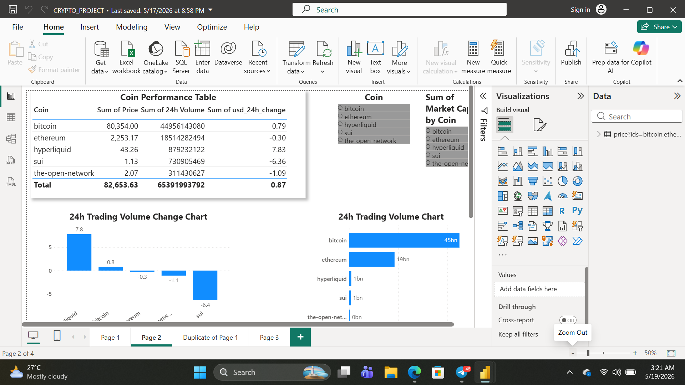
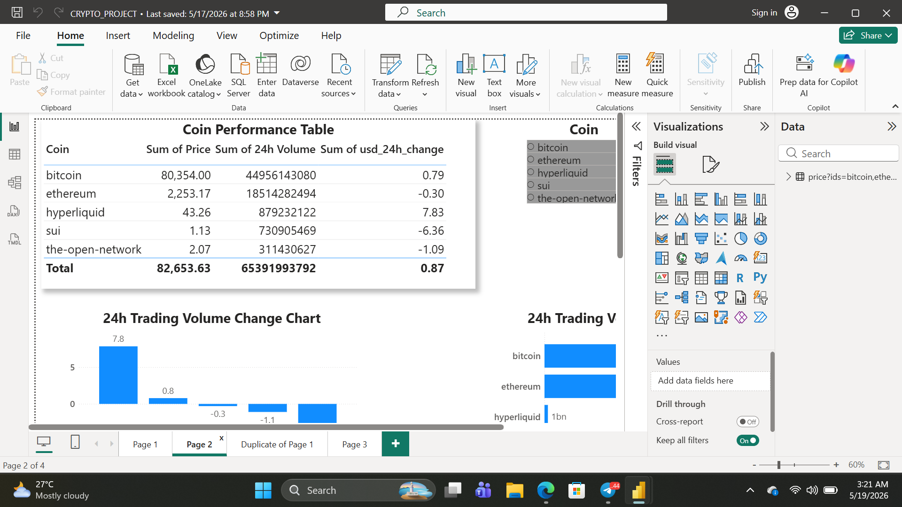
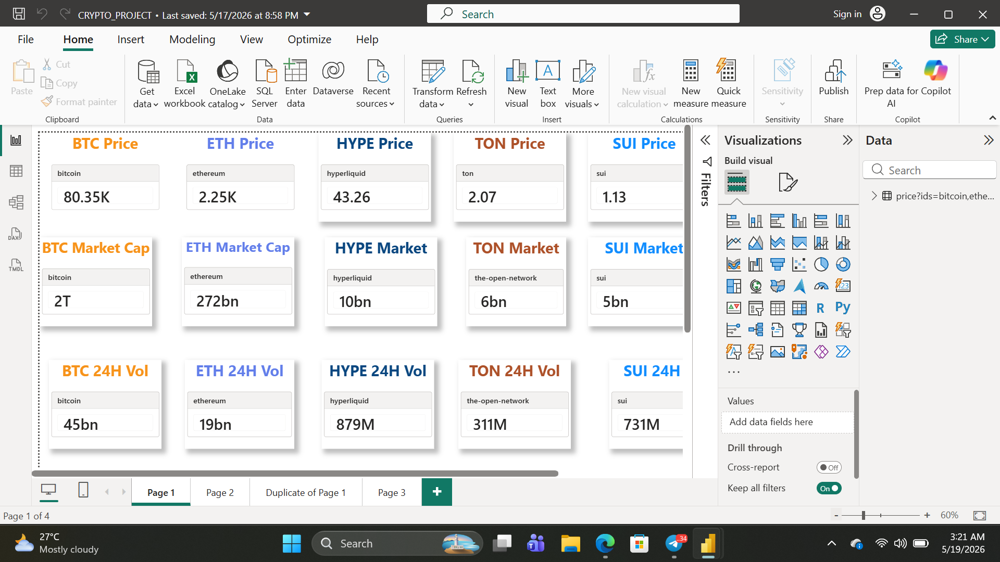

# Crypto-Market-Analytics-Dashboard-1
This project is a real-time Crypto Market Analytics Dashboard built in Power BI using the CoinGecko API.  The dashboard tracks cryptocurrency prices, market capitalization, trading volume, and historical trends for major coins such as Bitcoin, Ethereum, SUI, TON, and Hyperliquid.
## Dashboard Preview

## Tools & Technologies
- Power BI
- Power Query
- CoinGecko API
- DAX
- Data Modeling
- Github

  ## Features
  - Real-time cryptocurrency price tracking
  - Market capitalization monitoring
  - 24-hour price change tracking
  - Interactive slicers and filters
  - Dynamic KPI cards
  - API-powered live refresh
  - Multi-coin comparison
 
    ## Data Source
Data was collected using the CoinGecko API.
API Endpoint:
https://api.coingecko.com/api/v3/

## Key Insights
- Bitcoin maintained the highest market capitalization.
- Ethereum showed more stable price movement over time.
- Some altcoins displayed higher volatility during market swings.
- Trading volume spikes often aligned with price increases.

  ## Challenges Faced
- Handling nested JSON data from the API
- Managing live API refresh limitations

  ## Future Improvements
- Portfolio tracker
- Fear & Greed Index integration
- Candlestick charts
- Automated refresh using Power BI Service
- Top gainers and losers section

  ## Author

Tolulope Emmanuel

## LinkedIn
https://www.linkedin.com/in/tolulope-emmanuel-7601a321a?utm_source=share_via&utm_content=profile&utm_medium=member_ios

## GitHub
https://github.com/DaveJega/Crypto-Market-Analytics-Dashboard-1
